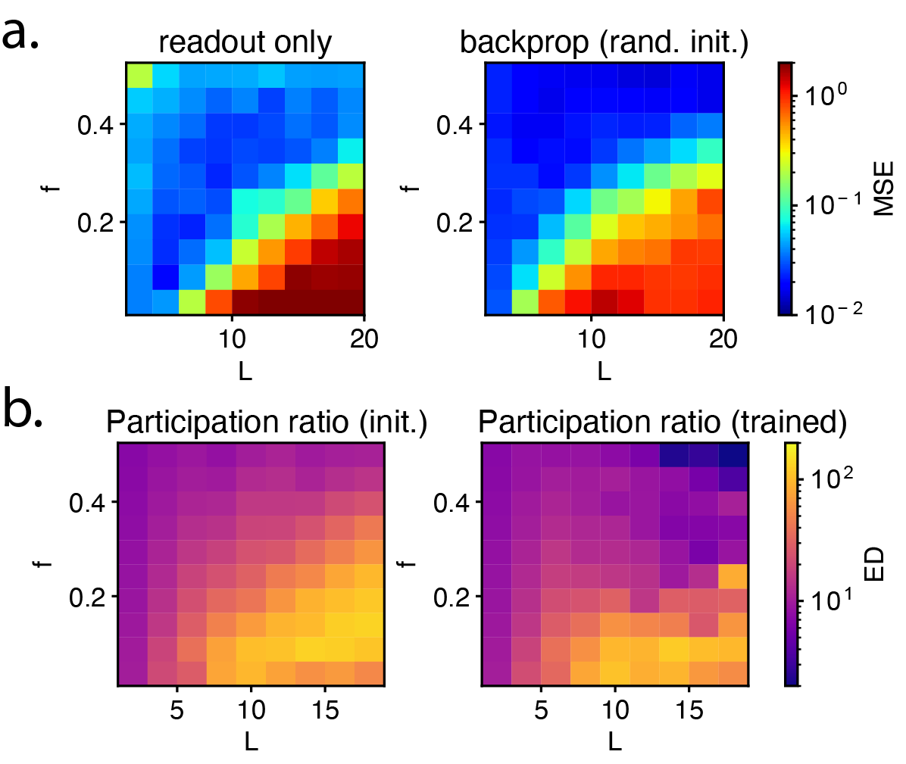

## Results on finite-width network trained with backpropagation

Here we trained a finite-width network using backpropagation on a circulant dataset, where the input datapoints are evenly spaced out along a circle, and the output is a periodic step function.
We vary the sparsity and depth of the network.

On the left top, we show the generalization performance of the same network but instead of having all weights trained using backpropagation, only the readout weights are trained.

On the right top, we show the generalization performance of the same network trained using backpropagation.

Both the readout-trained network and the fully-trained network have the similar pattern of the generalization performance that is observed in "Sparsity depth trade-off in infinitely wide neural network".

We observe that this is due to the fact that the effective dimensionality of the last hidden layer kernel, quantified by the participation ratio of the eigenvalues, is similar for both untrained and trained network. Only the kernel alignment directions are different.
This shows that there is a connection between a wide untrained network and a wide trained network. We aim to generalize this result to the case where we have correlated weights.
